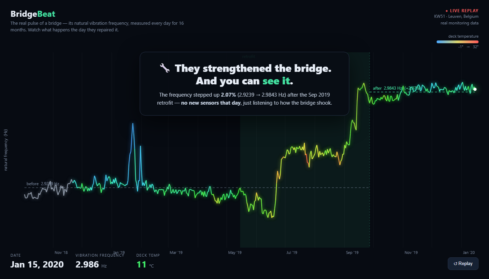
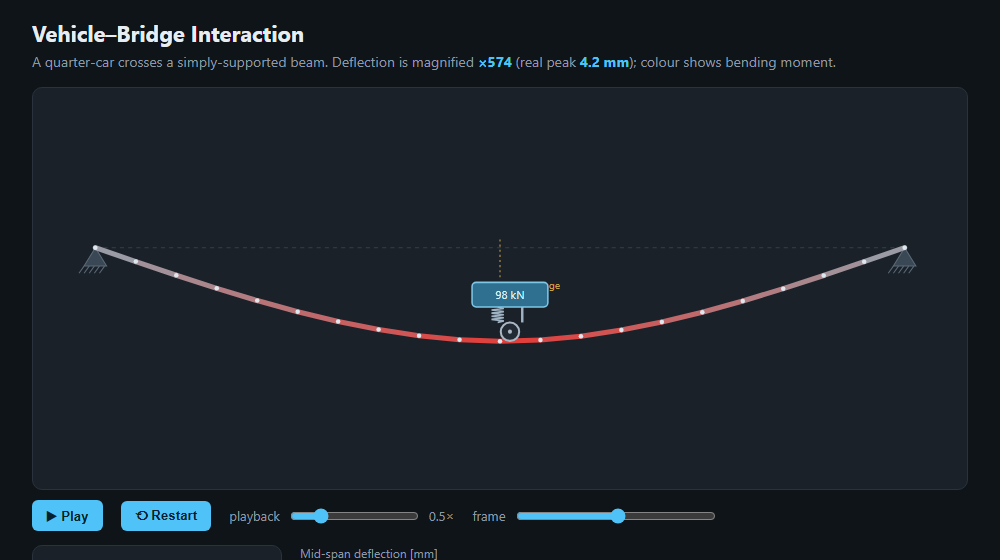
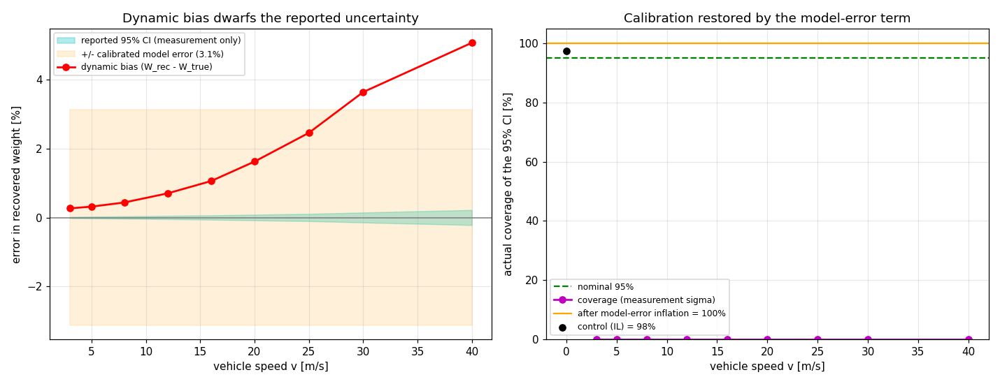
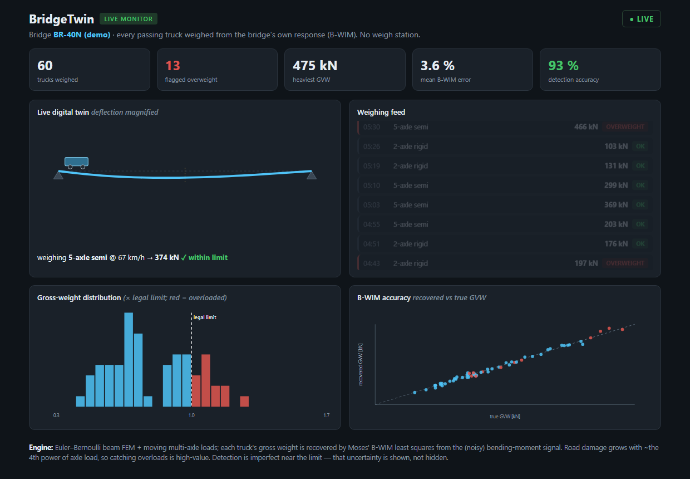
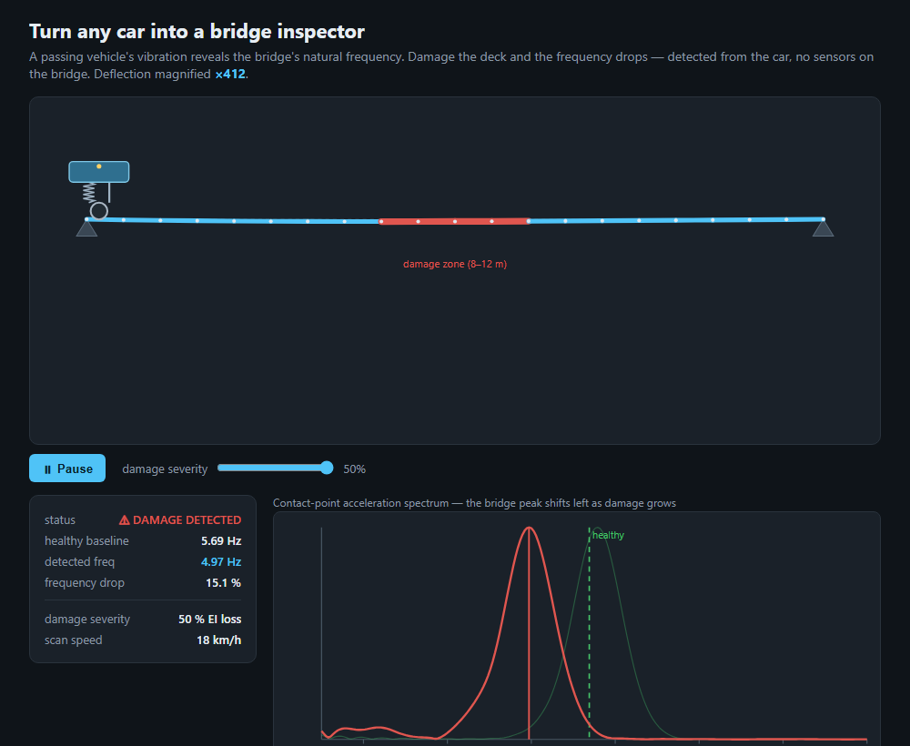

# Vehicle–Bridge Interaction (VBI) Simulator

A 2D **vehicle–bridge interaction** simulator that computes the *dynamic* response
of a bridge as a vehicle drives across it, and then runs the physics **backwards**
to weigh the truck from the bridge's response — the principle behind
**Bridge Weigh-in-Motion (B-WIM)**.

Each result is checked against a reference that ships with the code — an
analytical solution, a published benchmark, or a simulate-then-recover round-trip.
The core is numpy-only.

### BridgeBeat — watch a real bridge get repaired, from vibration alone

**Live demo: https://bypire.github.io/bridgebeat/**



*The 30-second hook (`web/bridgebeat.html`): the **real** natural-vibration frequency
of the KW51 bridge (Leuven), measured every day for 16 months, drawn like a heart
monitor and coloured by temperature. The pulse visibly **steps up the day they
strengthened the bridge** — +2.1 %, no new sensors, just listening to how it shook.
This is the cool part; the maths below is what makes it true.*



*The physics: a quarter-car at mid-span; the deck is coloured by bending moment and
the deflection is magnified. The panel shows the axle weight recovered from
the response by B-WIM. This forward+inverse engine — and its **validation** — is the
substance of the project.*



*The scientific result: a self-consistent Bayesian B-WIM coverage is 95.3 % by
construction (machinery verification), but under the real coupled dynamics the
nominal-95 % interval's true coverage collapses — the dynamic bias dwarfs the
reported uncertainty. The RMS bias (≈3.1 %) is the model-error term that restores
calibration. See `verify_coverage.py`.*



*An **engineering demo** layered on the validated physics: a live stream of trucks
weighed by B-WIM, with overload flags and a recovered-vs-true accuracy scatter. The
per-pass scatter is **calibrated** from the coverage study above (not a hand-tuned
knob). It is a product-style view of the engine, not the scientific claim.*

---

## Why this matters (the cost story)

- **Catching overloaded trucks.** Pavement and bridge damage grows with roughly
  the **4th power of axle load** (the "fourth power law" from the AASHO Road Test):
  a 2× overweight axle does ≈ **16×** the damage. The reference legal axle is the
  80 kN / 18 kip *Equivalent Single Axle Load* (ESAL). [1][2][3]
- **Bridge Weigh-in-Motion** turns an already-instrumented bridge into a scale,
  weighing trucks *at traffic speed* — cheaper and far harder to evade than static
  weigh stations. [4][5]
- **Drive-by / vibration monitoring** infers structural condition from dynamic
  response, reducing costly manual inspection of an ageing bridge stock. [7]

---

## What it does

1. **Forward model** — a vehicle crosses a simply-supported bridge; the simulator
   returns the deflection-time history, the bending moment at a sensor section,
   the wheel–bridge contact force, and the **dynamic amplification factor (DAF)**.
2. **Inverse model (B-WIM)** — from that bridge response it recovers the **axle
   weight(s)** with Moses' least-squares algorithm, including separating the axles
   of a multi-axle truck.
3. **Web viewer** — animates the crossing (deflecting deck coloured by moment,
   bouncing quarter-car) with live readouts and response plots. Opens by
   double-click; no server.

---

## Method (in four sentences)

The bridge is an **Euler–Bernoulli beam** discretised with 2-node beam finite
elements (2 DOF/node), giving a consistent mass matrix **M** and bending stiffness
**K**; the equation of motion **M ü + K u = F(t)** is marched in time with **RK4**.
The moving load is placed at its current position each step via the element's cubic
Hermite shape functions, so F(t) is rebuilt continuously. The vehicle is a 2-DOF
**quarter-car** (sprung + unsprung mass, suspension and tyre) coupled to the beam
through the contact force, giving two-way interaction. B-WIM inverts the measured
bending moment against the section's **influence line** by least squares
(**Moses' algorithm**) to recover the static axle loads.

---

## Verification, validation, and uncertainty — the heart of the project

**Verification ≠ validation.** Verification asks *is the math right?* (does the code
reproduce a closed form). Validation asks *does the model mean something?* (does it
hold up against dynamics it wasn't fitted to, and against real data). This project
does both, and keeps them clearly separate.

### Verification — every block against an analytical reference

| Check | Reference | Result |
|---|---|---|
| Static mid-span deflection | `P L³ / 48 E I` (closed form) | rel. err ≈ **1e-13** |
| Natural frequencies | `(nπ/L)² √(EI/m̄)` | mode 1 rel. err ≈ **4e-7** |
| Moving constant force | **Frýba** closed-form solution | peak rel. err ≈ **6e-6** |
| Quarter-car frequencies | analytic 2×2 eigenproblem | within FFT resolution |
| Newmark-β vs Frýba | closed-form moving force | match ≈ **2e-4** |
| Model order reduction (3 modes) | full-order response | reproduces to **0.16 %** |
| B-WIM weight (round-trip) | known input weight | gross **< 1 %** |

### Validation & UQ — where the project actually earns its keep

- **Model-error-aware uncertainty** (`verify_coverage.py`). A *self-consistent*
  Bayesian coverage test (forward = inverse = static influence line) returns 95.3 %
  — but that only **verifies the linear-Gaussian machinery**. Drive the inverse with
  the **full coupled dynamic FEM** instead and the recovered weight is biased by
  dynamic amplification (+0.3 % quasi-static → +5 % at 40 m/s); the residual σ
  measures goodness-of-*fit*, not the *scale* error, so the nominal-95 % interval's
  true coverage **collapses to ≈ 0 %**. The RMS dynamic bias over the highway band
  (**≈ 3.1 %**) is the model-error term that restores calibration — and it matches the
  `MODEL_UNC` the dashboard uses, so that number is now *calibrated from physics*.
- **Regularizing the ill-posed axle split** (`verify_regularize.py`). A tandem makes
  two influence-matrix columns nearly parallel, so `cond(CᵀC)` climbs (≈ 9 at 8 m → ≈
  2000 at 0.5 m) and Moses' split amplifies noise. **Tikhonov + an L-curve** cut the
  per-axle scatter **≈ 6×** (16 % → 2.6 %) for a small bias, leaving the well-posed
  gross weight untouched — the bias–variance trade-off, explicit.
- **Validation against real data — KW51** (`verify_kw51.py`). The 16-month tracked
  modal frequencies of the instrumented KW51 bridge (public dataset). A real, dated
  **retrofit** shifts the frequencies up to **+2.6 %** (the drive-by-SHM premise,
  confirmed in the field), while **temperature** swings them a comparable **up to
  ≈ 3.8 %** — for some modes *more* than the retrofit. Removing the temperature trend
  sharpens detectability (e.g. **9.8σ → 17.3σ**). The synthetic damage study's
  limit — frequency is a blunt, environment-contaminated indicator — holds on a real
  bridge. *(12.9 MB; fetched from Zenodo, not committed — see the script docstring.)*
- **Multiple-presence B-WIM** (`multi_vehicle.py`, `verify_multi.py`). Real traffic puts
  several trucks on the span at once; the convoy response is the exact superposition of
  the single-vehicle responses (verified to **1e-12**). Single-vehicle B-WIM is then
  corrupted — a following truck at short headway inflates the recovered weight by
  **+9 % to +140 %**. A **free-flow gate** (weigh only single-presence events) restores
  ~2 % accuracy at the cost of throughput (e.g. at 20 trucks/min only ~26 % of events are
  clean). Hardened with a **full dynamic round-trip** (`verify_gate.py`): the real coupled
  convoy sim + measurement noise, Monte-Carlo'd → error bars. The clean single-presence
  floor is **+1.2 % ± 0.4 %**; ungated stream error climbs to **37 % (12 trucks/min) →
  72 % (30/min)**, and the gate restores the clean floor by keeping only single-presence
  events. Multiple presence is a known primary B-WIM error source (COST323; O'Brien et
  al.); here it is quantified on an open model.

---

## How to run

Python core needs **only numpy**. (matplotlib is used solely by the `verify_*`
scripts for optional plots; the core never imports it.)

```bash
# --- Phase 1: forward simulator + B-WIM ---
python solver/verify.py               # V1: static deflection + frequencies
python solver/verify_v2.py            # V2: moving force vs Frýba + DAF
python solver/verify_v3.py            # V3: quarter-car coupling, DAF vs speed
python solver/verify_bwim.py          # B-WIM single-axle weight recovery
python solver/verify_bwim_multi.py    # B-WIM multi-axle separation
python solver/validate_literature.py  # V5: validation + literature benchmark
python solver/export.py               # writes output/sim_data.js
#  → double-click web/index.html  (VBI + B-WIM animation)

# --- Phase 2: drive-by structural health monitoring ---
python solver/verify_d1.py            # ISO 8608 road roughness + vehicle accel
python solver/verify_d2.py            # bridge frequency from vehicle acceleration
python solver/verify_d3.py            # contact-point response vs raw acceleration
python solver/verify_d4.py            # detect localized damage from the vehicle
python solver/verify_residual.py      # two-axle residual beats road roughness
python solver/export_driveby.py       # writes output/driveby_data.js
#  → double-click web/driveby.html  (drive-by damage-detection demo)

# --- Phase 3: realistic 40 m overpass + damping + interactive explorer ---
python solver/verify_p1.py            # 40 m overpass + Rayleigh damping check
python solver/export_explore.py       # writes output/explore_data.js
#  → double-click web/explore.html  (speed slider, DAF curve, B-WIM)

# --- Phase 4: BridgeTwin operations dashboard (the platform view) ---
python -u solver/export_traffic.py    # weighs a traffic stream by Bayesian B-WIM
#  → double-click web/dashboard.html  (live monitor: KPIs, feed, overloads)

# --- Phase 5: computational-methods depth (CES core) ---
python solver/verify_newmark.py       # implicit Newmark-β vs Frýba + stability
python solver/verify_bayesian.py      # Bayesian B-WIM: credible intervals, coverage
python solver/verify_mor.py           # model order reduction (modal truncation)

# --- Validation & UQ (verification vs validation; the scientific spine) ---
python -u solver/verify_coverage.py   # model-error coverage: calibrate the UQ
python -u solver/verify_regularize.py # Tikhonov + L-curve fix the ill-posed axle split
python -u solver/verify_kw51.py       # VALIDATION vs real KW51 data (fetch first; see docstring)
python -u solver/calibrate_kw51.py    # reduced-model calibration to KW51's f1
python -u solver/verify_fatigue.py    # fatigue & economics: what an overload actually costs
python -u solver/verify_multi.py      # multi-vehicle physics + the multiple-presence B-WIM problem
python -u solver/verify_gate.py       # free-flow gate, hardened: dynamic round-trip + noise + error bars
```

## From measurement to decision

Weighing a truck only matters if the number drives a decision. `solver/fatigue.py`
closes that loop: fatigue damage grows with the **cube-to-4th power** of axle load
(Eurocode EN 1993-1-9 / AASHTO), so the recovered weight converts directly into
**bridge life consumed**. The consequences are sharp and verified:

- a **2× overloaded** truck does **8× (steel) / 16× (pavement)** the damage — *exact*;
- across a simulated traffic stream, the heaviest **10 %** of trucks cause **~45 %** of
  the fatigue damage, and the overloaded minority causes **~half** of it — and B-WIM
  flags exactly those trucks;
- as an asset-depreciation estimate, one heavy truck eats **~€10** of bridge life in a
  single crossing (vs **€0.80** for a legal pass).

That is the engine for **self-funding overload enforcement** and **drive-by health
monitoring** — the same maths that weighs the truck prices the damage and names the
culprit. The visual front door is **`web/bridgebeat.html`**: a 5-act interactive story — weigh a
moving truck (scrub it across; the deck dips a believable ~1.6 mm, shown lightly
magnified), diagnose damage from the wiggle, watch a *real* bridge get repaired (KW51),
see the stakes (fatigue economics), and step back to a **500 m multi-span viaduct** under
a full traffic stream — watched from above like an inspector, with a live ledger of load,
overloads and accumulating fatigue cost.
A **Simple ⇄ Math** toggle serves both a lay audience (plain language) and a reviewer
(equations, error bars, DAF, references) from the same page; the older tester-style
pages live behind the **Lab** link.

Both viewers take optional deep-links for screenshots: `web/index.html#f=205`
(start paused on a frame) and `web/driveby.html#sev=5` (start at a severity).

## Phase 5 — computational-methods depth (CES core)

Method work that turns the demo into research-grade computational engineering:

- **Newmark-β** implicit integrator (the structural-dynamics standard) — matches
  Frýba to ~2e-4 and, being unconditionally stable, takes a **~1000× larger step**
  than explicit RK4 on the damped bridge for the same answer.
- **Bayesian / UQ B-WIM** — the axle-weight inverse as a linear-Gaussian posterior:
  recovered weight with a **95% credible interval** and a calibrated **overload
  probability** (verified by coverage: the true weight sits inside the 95% interval
  95.3% of the time; the P(overload) curve crosses 0.5 exactly at the legal limit).
  Wired into the dashboard (weight ± CI, P(overload), OK/UNCERTAIN/OVERWEIGHT).
- **Model order reduction** (modal truncation) — 3 modes reproduce the response to
  0.16 %, with ~13× fewer DOFs and a ~226× larger stable step.

## Phase 3 — realistic scale, damping & an interactive explorer

The toy 20 m beam is scaled up to a realistic **40 m simply-supported highway
overpass** (f₁ ≈ 2.6 Hz, matching the f ≈ 100/L rule of thumb) with **Rayleigh
damping** (ζ = 2 %, verified by a free-vibration log-decrement to 0.1 %). An
interactive web explorer (`web/explore.html`) lets you slide the vehicle speed and
watch the deflection, the DAF, the DAF-vs-speed curve and the B-WIM weight update
live, with plain-language annotations. The drive-by demo (`web/driveby.html`) is
rebuilt at the same 40 m scale. *Note: stiffness-proportional damping forces a
tiny explicit-RK4 step, so the drive-by export runs undamped (negligible effect on
the frequency extraction); damping realism is shown in the explorer.*

## Phase 2 — drive-by structural health monitoring

A thesis-flavoured "Teillösung" of an active research niche: read a bridge's
condition from the response of a single passing instrumented vehicle, with **no
permanent sensors on the bridge**.



*Slide the damage severity; the contact-point acceleration spectrum's bridge peak
marches left (5.69 → 4.97 Hz at 50 % stiffness loss) and the panel flips to DAMAGE
DETECTED. Detected frequency tracks the FEM ground truth to ~2 %.*

- **D1** ISO 8608 road profiles (PSD slope ≈ −2, RMS to ~5 %); roughness inflates
  the vehicle's RMS vibration ~16× over the bridge signal — the core challenge.
- **D2** the bridge frequency falls cleanly out of the vehicle acceleration on a
  smooth road (peak prominence ~1200×), then gets buried as roughness rises.
- **D3** the contact-point response (Yang 2020) reconstructed from accelerations
  recovers the bridge frequency (~1.7 %) and suppresses spurious vehicle-mode
  peaks; the limit — single-pass CP does **not** beat heavy road roughness
  (that needs two-axle / residual methods).
- **D4** a local EI loss lowers the frequency; the passing vehicle **detects** the
  drop (≈2 % error vs FEM on a smooth road) but cannot **localize** it — a single
  global frequency carries no position information. Honest limit — frequency is a
  blunt, global indicator: 10 % local damage shifts f₁ by only ~0.12 Hz. *(This very
  limit is then confirmed on real data in `verify_kw51.py`.)*
- **D6** a **two-axle residual** climbs D3's roughness wall: the rear axle rides
  the same road as the front (delayed by spacing/speed), so a time-shifted
  subtraction cancels the common road profile. On class B/C roads the single-axle
  peak is at the wrong (road) frequency (~20 % error, buried), while the residual
  recovers the bridge peak (~6 % error, prominence 1.3 → 4.5). Ideal cancellation
  here; real tyres/tracks make it partial.

---

## Project layout

```
solver/                      Python core (numpy only) + verification scripts
  beam_fem.py                Euler–Bernoulli beam FEM (assemble M, K)
  moving_load.py             moving load, bending moment, Frýba, multi-axle march
  vehicle.py                 quarter-car + coupled beam–vehicle RK4 integrator
  bwim.py                    influence line + Moses least-squares recovery
  export.py                  writes output/sim_data.js for the web viewer
  verify_*.py / validate_*   reference checks (run these to see the numbers)
web/                         vanilla JS + inline SVG viewer (no framework, no server)
output/                      generated data + plots
```

---

## Background

1. **Static truss analyzer** — direct stiffness method, hand-verified forces.
2. **VBI simulator (this)** — dynamics in time: beam FEM + moving load + vehicle
   coupling, verified against the Frýba closed form.
3. **B-WIM** — the *inverse* problem: recover the cause (axle weight) from the
   effect (bridge response). Forward simulation → real engineering question.

---

## Limitations

- One **simply-supported single span**; linear, small-displacement
  Euler–Bernoulli theory (no buckling, no material/geometric nonlinearity).
- Road roughness is modelled (ISO 8608, Phase 2) but the drive-by extraction is
  only demonstrated in the low-roughness regime; heavy roughness needs two-axle /
  residual techniques (noted, not built).
- Rayleigh damping (ζ = 2 %) is supported and verified; some batch exports run
  undamped for speed (stiffness-proportional damping shrinks the explicit step).
- A single **quarter-car** (one wheel path); the multi-axle B-WIM demo uses
  constant axle forces.
- B-WIM uses the **analytical** influence line; field systems calibrate it from a
  known truck, and real accuracy is degraded by roughness, multiple vehicles, and
  temperature effects.
- Drive-by SHM **detects** a global stiffness change but does **not localize** it.
- Real bridge data **is processed** for the modal-frequency validation (KW51 tracked
  modes); raw acceleration time-series and a full FEM model of KW51's arch geometry
  are out of scope (KW51 is a 115 m steel arch, not our simply-supported beam).

---

## References

1. *Fourth power law* — https://en.wikipedia.org/wiki/Fourth_power_law
2. *AASHO Road Test* — https://en.wikipedia.org/wiki/AASHO_Road_Test
3. *Equivalent Single Axle Load* — https://pavementinteractive.org/reference-desk/design/design-parameters/equivalent-single-axle-load/
4. *A regularised solution to the bridge weigh-in-motion equations* (Moses vs regularised; individual-axle errors ~20–23 %) — https://researchrepository.ucd.ie/rest/bitstreams/13125/retrieve
5. *European specification on weigh-in-motion (COST323)* accuracy classes — https://www.researchgate.net/publication/341911554
6. Bridge dynamic load allowance / DAF — design-code background (e.g. AASHTO LRFD impact factor).
7. *Damage identification for bridges using machine learning: KW51* — https://arxiv.org/html/2408.03002v1 · dataset: https://zenodo.org/records/3745914

> Method reference for the moving-load closed form: L. Frýba, *Vibration of Solids
> and Structures under Moving Loads*.
